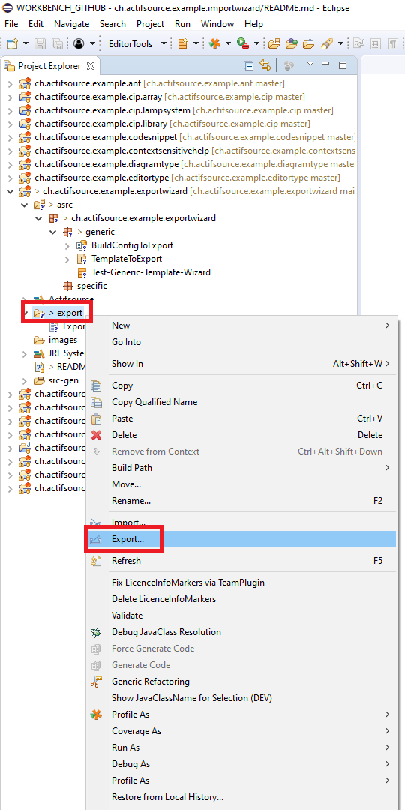
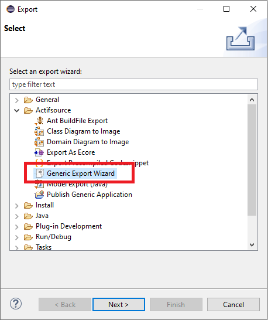

# Generic Export Wizard
In this project we will show how to export a simple buildConfig.  
Show in the actifsource user manual [Generic Export Wizard](https://www.actifsource.com/_downloads/ActifsourceManual_ActifsourceUserManual.pdf).

## Wizard

## Requirements
Actifsource Workbench Enterprise Edition

## License
[http://www.actifsource.com/company/license](http://www.actifsource.com/company/license)
